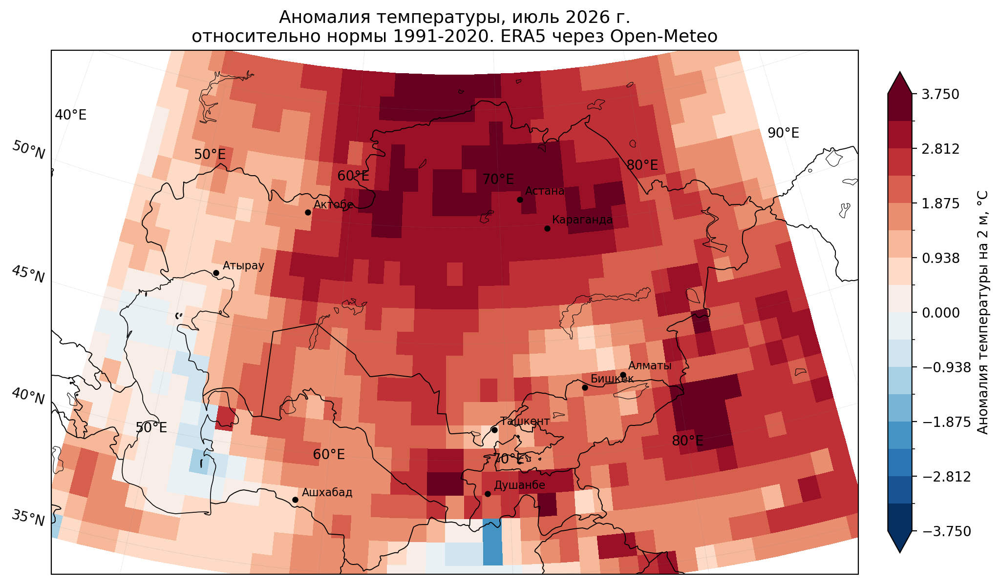

# Аномалии июльской температуры: Казахстан и Центральная Азия

Интерактивная карта отклонений средней июльской температуры воздуха от нормы 1991–2020,
1991–2026 гг., по реанализу ERA5.

**Карта:** https://github.com/AigulBekbayeva/temp_anom_map/



## Что здесь

Регион — Казахстан и Средняя Азия (46–88° в.д., 35–56° с.ш.). Расчёт на сетке 1° (946 узлов);
шаг задаётся константой `GRID_STEP`, при 0.5° узлов становится 3655.
Для каждого узла считается средняя температура июля по суточным данным, затем
отклонение от климатической нормы той же ячейки.

Норма — среднее за **1991–2020**: стандартный базовый период ВМО. Выбор базы принципиален:
относительно 1961–1990 те же аномалии оказались бы примерно на градус больше, поэтому
сравнивать цифры из разных источников без указания базы бессмысленно.

## Данные

[ERA5](https://climate.copernicus.eu/climate-reanalysis) — реанализ ECMWF, разрешение 0.25°,
доступ через [Open-Meteo Historical Weather API](https://open-meteo.com/en/docs/historical-weather-api)
(без регистрации в CDS, без ожидания в очереди).

Реанализ — не наблюдения: это результат усвоения наблюдений в модель. Над Центральной Азией
плотность станций невысока, в горах ERA5 сглаживает рельеф, поэтому абсолютные температуры
в Тянь-Шане и на Памире смещены. На **аномалиях** это сказывается слабее, чем на абсолютных
значениях, так как систематическая ошибка вычитается вместе с нормой — но полностью не исчезает.

## Воспроизведение

```bash
pip install -r requirements.txt

python src/july_anomaly_openmeteo.py   # загрузка + карта PNG + ряд по годам
python src/export_web.py               # docs/data/anomalies.json для веб-карты
```

Первый запуск на сетке 1° качает 36 лет × 10 запросов ≈ 360 обращений к API (на 0.5° — вчетверо больше). Каждый год кэшируется
в `data/*.npz`, повторные запуски и смена целевого года ничего не перекачивают.
На бесплатном тарифе Open-Meteo это упрётся в суточный лимит — либо укажите
`API_KEY` в `src/july_anomaly_openmeteo.py`, либо поставьте `GRID_STEP = 1.0`.

Настройки — в шапке `src/july_anomaly_openmeteo.py`: регион, `MONTH`, база, `TARGET_YEAR`,
`GRID_STEP`, `MODEL` (`era5` 0.25° / `era5_land` 0.1°, только суша / `era5_seamless`).
`export_web.py` определяет месяц, шаг и модель из имён файлов кэша сам — дублировать
константы не нужно.

## Структура

```
src/july_anomaly_openmeteo.py   загрузка ERA5, расчёт аномалий, статичные карты
src/export_web.py               экспорт в компактный JSON для веба
docs/index.html                 интерактивная карта (Leaflet, без сборки)
docs/data/anomalies.json        поле аномалий по годам (~0.2 МБ при шаге 1°)
figures/                        картинки для README и публикаций
```


## Лицензия и атрибуция

Код — MIT. Данные — ERA5, Copernicus Climate Change Service (C3S),
предоставлены через Open-Meteo (CC BY 4.0). Подложка © CARTO, © OpenStreetMap contributors.

> Neither the European Commission nor ECMWF is responsible for any use of the Copernicus information.
